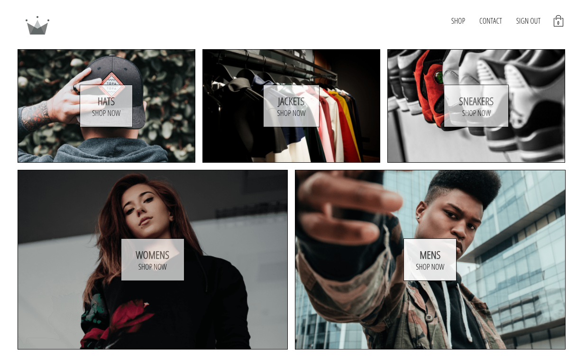

# CROWN cloth e-commerce React project

### Description

Simple react e-commerce project, created as example of using Context API from react library. App uses Firebase (firestore and authentification) as a backend.

It's just an example of how to use Context API as a state manager for small and medium projects. This project has it's twin with an Apollo GraphQL as a state management. You can find it [here](https://github.com/for-alisia/crown-apollo)

### Installation

1. Clone project: git clone https://github.com/for-alisia/crown-context.git crown-clth-context
2. npm install
3. npm start
